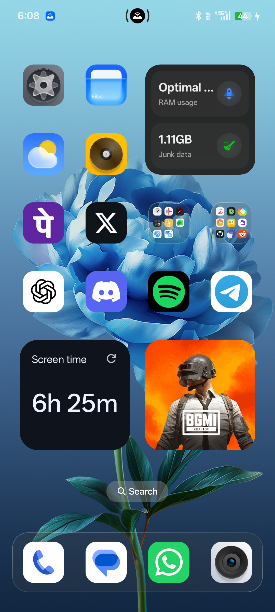

# Advanced ADB Toolkit - Phone Link Alternative

📱 A powerful, modern Desktop-to-Phone toolkit built with Python and CustomTkinter. It serves as a lightweight, faster alternative to Microsoft's Phone Link, providing advanced screen mirroring, remote control, and device management capabilities directly over USB or Wi-Fi.



## ✨ Features

*   **📺 Advanced Screen Mirroring (via Scrcpy)**
    *   One-click screen mirroring with auto-launch detection.
    *   **Auto-Mirror**: Automatically launches mirroring when a device connects.
    *   **Auto-Close**: Automatically closes mirroring when the app is closed.
    *   **Battery Saver**: Option to turn off the phone screen while mirroring.
    *   **Screen Recording**: Record your phone screen directly to your PC desktop (`.mkv` format).
    *   **Overlay Mode**: Minimizing the main window creates a floating widget that sticks to your mirror window!
*   **🎮 Remote Control & Injection**
    *   Simulate hardware keys: Volume Up/Down, Power, Play/Pause, Home, and Back.
    *   **Text Injection**: Seamlessly type from your PC keyboard directly into your phone.
*   **📦 Apps & Files Management**
    *   List all installed 3rd-party applications.
    *   Quick launch apps directly from your PC.
    *   Open App Info to quickly clear cache or manage permissions.
    *   **Quick Photo Pull**: Instantly pull the latest 5 photos/videos from your camera roll to your PC Desktop.
*   **📡 Wireless ADB (No USB Required)**
    *   Easily switch from USB to a completely wireless connection.
    *   Auto-detect phone IP address and connect seamlessly over Wi-Fi.
*   **🖥️ Built-in Console Logs**
    *   Toggleable console to view real-time ADB commands and system logs.

## ⚙️ Requirements

*   **Python 3.x**
*   **CustomTkinter:** For the modern UI.
    ```bash
    pip install customtkinter
    ```
*   **ADB (Android Debug Bridge):** Must be installed and added to your system's PATH.
*   **Scrcpy:** The screen mirroring relies on `scrcpy`. The application expects the executable at `scrcpy-win64-v3.3.4/scrcpy-win64-v3.3.4/scrcpy.exe` relative to the main script.

## 🚀 Getting Started

1.  **Enable USB Debugging** on your Android device:
    *   Go to *Settings* -> *About Phone* -> Tap *Build Number* 7 times.
    *   Go back to *Settings* -> *Developer Options* -> Enable *USB Debugging*.
2.  **Connect your phone** to your PC via USB.
3.  **Run the application**:
    ```bash
    python AdbToolkitGUI.py
    ```
4.  Accept the RSA key prompt on your phone if it's the first time connecting to this PC.

## 📝 Usage Notes

*   **Wireless ADB**: Connect via USB first, navigate to the "Wireless ADB" tab, click "Enable TCP/IP", unplug your USB, auto-find the IP, and hit "Connect Wi-Fi".
*   **Overlay Icon**: Minimize the main window to see a small floating icon. Double-click it to restore the main GUI.
